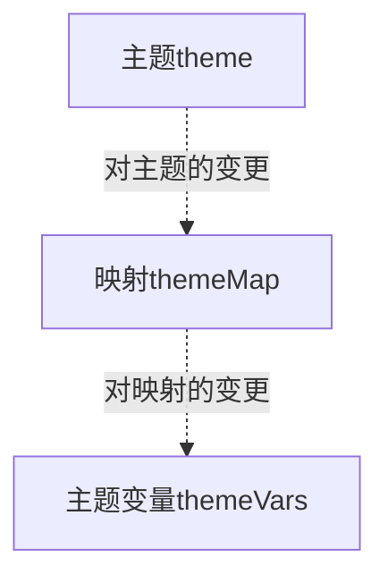
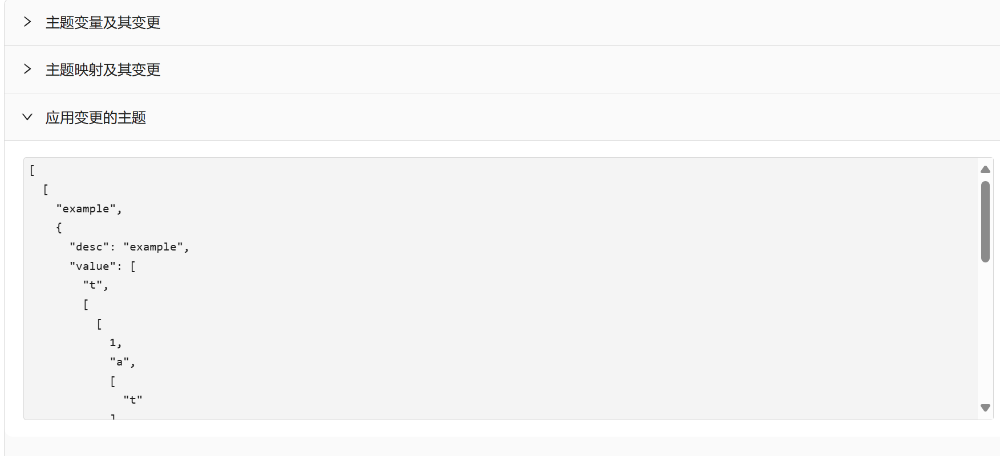
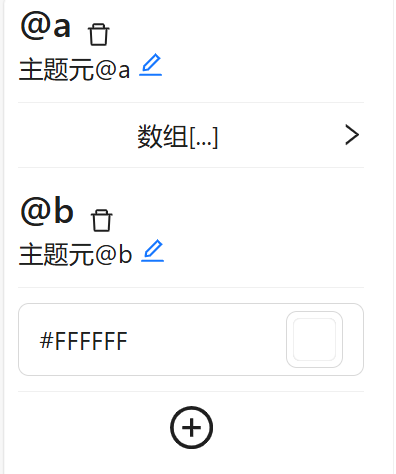
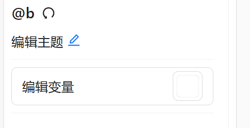
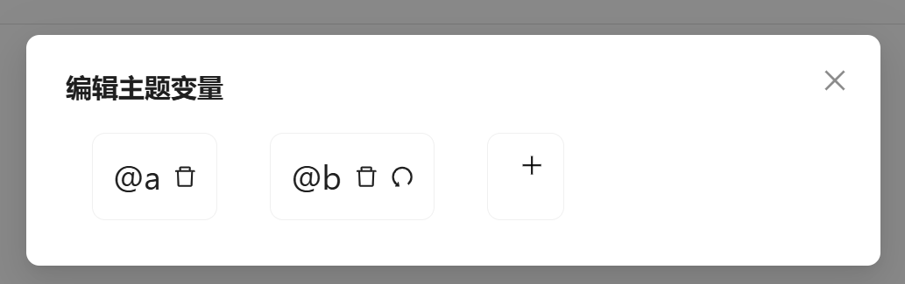
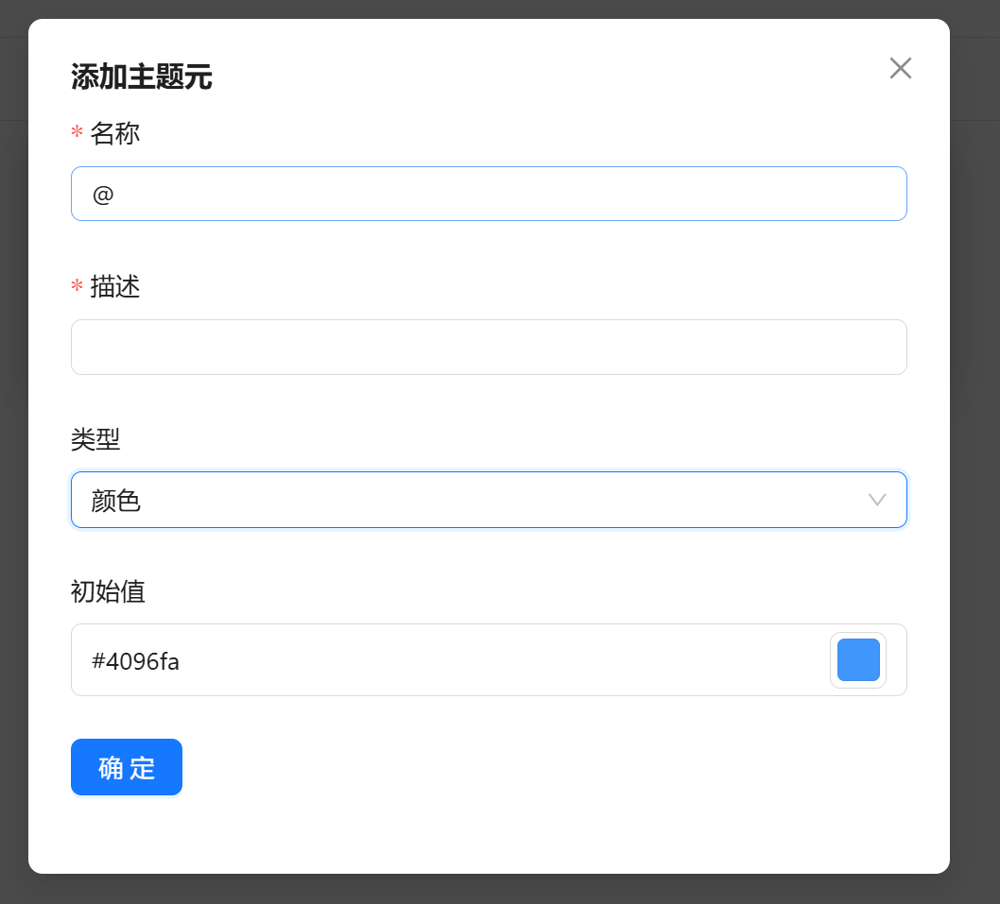
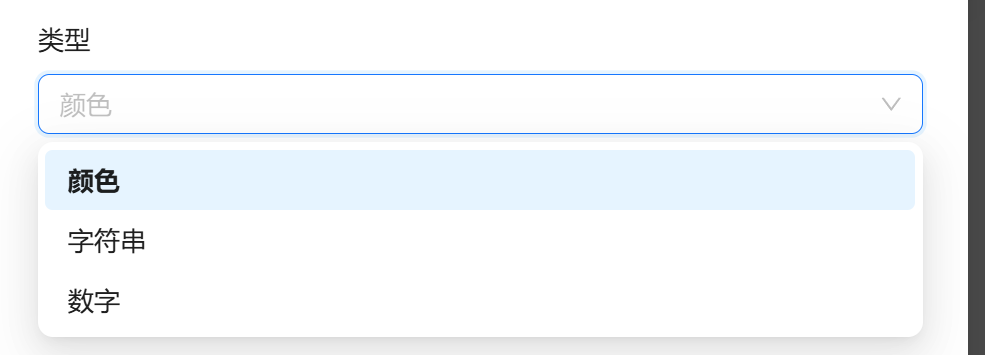

# 主题工具系统
## 主题生成方式

* 组件使用主题变量调整展示结果
* 主题与映射可以生成主题变量
* 主题和映射可以分别变更,并选择是否应用变更
* 变更包括主题和映射增、删、改
## 主题体系的设计
### 主题元和主题变量 `@/lib/Theme/ThemeVar.ts`  
主题变量是名称与主题元的映射关系.主题元是对应名称所指示的描述和值.  
```ts
/** 主题元值基础类型 数字、字符串(可被识别为颜色) */
type ThemeItemBaseValue<T> = number | string | T

/** 主题元值类型 基础类型或它的嵌套数组 */
type ThemeItemValue<T> = ThemeItemBaseValue<T> | ThemeItemValue<T>[]

/** 主题元 */
type ThemeItem<T> = {
  /** 主题元描述 */
  desc: string,
  /** 主题元值 */
  value: ThemeItemValue<T>
}

/** 主题 */
type ThemeVar<T> = Map<string, ThemeItem<T>>
```
主题元值的类型采用泛型,这使得它可以在字符串和数字的基础上进行拓展
#### 约定
* 主题元名称  
  合法名称必须经过正则表达式`/^@([a-z]+-)*[a-z]+$/`的校验.'@'开头,后续是'-'隔开的小写字母,例如`@primary-color`.
* 对主题元名称的拓展  
  符合正则表达式`/^@([a-z]+-)*[a-z]+(-G[0-9])?(-A[0-9]{1,3})?$/`的字符串被视为合法主题元的拓展.以`@primary-color-G3-A100`为例,如果`@primary-color`的值是合法的颜色字符串,它的含义是以`@primary-color`为主色生成的系列色的第3个颜色,且透明度为100.
#### 示例
```ts
Map
{
    '@version' => { desc:'版本号', value:'1' },
    '@theme-name' => { desc:'主题名', value:'example' },
    '@primary-color' => { desc:'主题主色', value:'#4096ff' },
    '@title-font-size' => { desc:'文本主字号', value:24 }
}
```
#### 主题变量变更
主题变量变更是主题元名称与变更结果的映射
```ts
/** 变更类型 */
type ThemeVarEdit<T> = { type: 'add', value: ThemeItem<T> }
  | { type: 'delete' }
  | { type: 'valueChange', value: ThemeItemValue<T> }
  | { type: 'descChange', desc: string }
  | { type: 'change', value: { value: ThemeItemValue<T>, desc: string } }

/** 主题变量变更 */
type ThemeVarEditRecorder<T> = Map<string, ThemeEdit<T>>
```
##### 主题变量变更的约定
* 映射的key是合法主题元名称,但不必包含在主题中.
* 对变更的解释  
  假设存在变更`key => { type, value(或desc) }`
  - 若type为'delete',则主题中同名主题元被视为删除;
  - 若type为'valueChange'且key在主题中,则value被视为该主题元的新值;
  - 若type为'descChange'且key在主题中,则desc被视为该主题元的描述;
  - 若type为'change',视为同名主题元被value完全替换;
  - 若type为'add',则视作主题中增加映射`key => value`.
##### 主题变量变更示例
变更
```ts
Map
{
    '@version' => '1.0.1'
}
```
应用变更的主题
```ts
Map
{
    '@version' => { desc:'版本号', value:'1.0.1' },
    '@theme-name' => { desc:'主题名', value:'example' },
    '@primary-color' => { desc:'主题主色', value:'#4096ff' },
    '@title-font-size' => { desc:'文本主字号', value:24 }
}
```
### 主题映射 `@/lib/Theme/ThemeMap.ts`
主题映射是主题变量的属性与生成结果的映射.生成结果可以是属性映射,也可以是具有下级结果的子映射
```ts
/** 属性映射值的基础类型 主题元名称、字符串、数字*/
type PropertyMapBaseValue = string | number

/** 属性映射值类型 基础类型或它的嵌套数组 */
type PropertyMapValue = PropertyMapBaseValue | PropertyMapValue[]

/** 每个映射的基础类型 */
type ThemeMapItemBaseType = {
  /** 对当前层级主题变量的描述 */
  desc: string
}

/** 属性映射 */
type PropertyMap = ThemeMapItemBaseType & {
  /** 对应主题变量的值 */
  value: PropertyMapValue
}

/** 具有下级结构的子映射 */
type SubThemeMap = ThemeMapItemBaseType & {
  children: ThemeMap
}

/** 主题映射 */
type ThemeMap = Map<string, PropertyMap | SubThemeMap>
```
#### 约定  
* `PropertyMapValue`的解释
  value描述了对应属性的值:
  - 若value是主题包含的合法主题元,则它被解释为对应主题元的值;
  - 若value是普通字符串或数字,以value作为此属性的值;
  - value是数组时,它的每一项分别按照此规则解释后重新组合为数组.
#### 示例
```ts
Map
{
    'version' => { value:'@version', desc:'当前主题版本号' },
    'themeName' => { value:'@theme-name', desc:'当前主题名称' },
    'example' => {
        desc:'示例',
        children:
        Map{
            'Title' => {
            desc:'标题',
            children:
                Map{
                    'size' => { value:'@title-font-size', desc:'标题字号' }
                }
            },
            'Panel' => {
                desc:'面板',
                children:
                Map{
                    'gradient' => { 
                        value:['@primary-color-G3-A100','@primary-color-G3-A0'],
                        desc:'渐变背景'
                    }
                }
            }
        }
    }
}
```
#### 映射变更
定义映射索引为`映射中各级属性名用'.'连接形成的字符串`.`'version'`,`'example'`,`'example.Title.size'`都是示例映射的映射索引.映射索引可以指向映射中不存在的对象或属性.  
映射变更是映射索引与变更结果的映射.
```ts
/** 变更类型 */
type ThemeMapEdit = { type: 'add', value: SubThemeMap | PropertyMap }
  | { type: 'delete' }
  | { type: 'change', value: PropertyMapValue }
  | { type: 'descChange', desc: string }

/** 映射变更 */
type ThemeMapEditRecorder = Map<string, ThemeMapEdit>
```
##### 映射变更的约定
* 变更总是按照顺序同步地应用于映射.因此可以先添加一个映射再对齐进行修改.
* 对变更的解释
  假设存在变更`key => { type, value(或desc) }`
  - 若type为'delete',key的目标被视作删除
  - 若type为'change'且key的目标是属性映射,这个属性映射的的值被value替换
  - 若type为'descChange'且key的目标在映射中,这个属性映射的的desc被desc替换
  - 若type为'add'且key的目标在映射中,视为key的目标被value完全替换
  - 若type为'add',key去除最后一部分索引后指示的目标是由下级结构的子映射,则在此子映射下以value创建新映射.(例如'example.Title1'会创建新映射,而'example1.Title1',''version'.'example'则不会,'example'指示的目标是子映射而非属性映射)
##### 映射变更示例
变更
```ts
Map
{
    'example.Title.size'=>'30px'
}
```
应用变更的映射
```ts
Map
{
    'version' => { value:'@version', desc:'当前主题版本号' },
    'themeName' => { value:'@theme-name', desc:'当前主题名称' },
    'example' => {
        desc:'示例',
        children:
        Map{
            'Title' => {
            desc:'标题',
            children:
                Map{
                    'size' => { value:'30px', desc:'标题字号' }
                }
            },
            'Panel' => {
                desc:'面板',
                children:
                Map{
                    'gradient' => { 
                        value:['@primary-color-G3-A100','@primary-color-G3-A0'],
                        desc:'渐变背景'
                    }
                }
            }
        }
    }
}
```
### 主题 `@/lib/Theme/index.ts` 
主题是主题变量应用于映射上的结果
```ts
/** 主题属性值基础类型 字符串、数字或者主题元的值 */
export type PropertyBaseValue<T> = PropertyMapValue | ThemeItemValue<T>

/** 主题属性值类型 基础类型或它的嵌套数组 */
export type PropertyValue<T> = PropertyBaseValue<T> | PropertyValue<T>[]

/** 主题属性类型 */
export type Property<T> = ThemeMapItemBaseType & {
  /** 变量值 属性值基础类型或者它的数组 */
  value: PropertyValue<T>
}

/** 具有下层结构的主题子主题 */
export type SubTheme<T> = ThemeMapItemBaseType & {
  /** 下层结构 */
  children: Theme<T>
}

/** 主题 */
export type Theme<T> = Map<string, Property<T> | SubTheme<T>>
```
#### 示例
以前文所述主题、映射及其变更为例,生成以下主题变量
应用变更的主题
```ts
Map
{
    'version' => { value:'1.0.1', desc:'当前主题版本号' },
    'themeName' => { value:'example', desc:'当前主题名称' },
    'example' => {
        desc:'示例',
        children:
        Map{
            'Title' => {
            desc:'标题',
            children:
                Map{
                    'size' => { value:'30px', desc:'标题字号' }
                }
            },
            'Panel' => {
                desc:'面板',
                children:
                Map{
                    'gradient' => { 
                        value:['#4096ffff','#4096ff00'],
                        desc:'渐变背景'
                    }
                }
            }
        }
    }
}
```
## 主题的使用
利用`@/lib/Theme/index.ts`导出的资源使用和编辑主题
#### 创建主题上下文
在`@/utils/theme/index.tsx`中
```tsx
'use client'

import { createTheme } from "@/lib/Theme"

export const { ThemeProvider, useTheme } = createTheme()
```
#### 使用ThemeProvider
在根布局`app/layout.tsx`中,为下层组件提供主题上下文
```tsx
import { ThemeProvider } from "@/utils/theme";

// 组件内
  <ThemeProvider>
    {props.children}
  </ThemeProvider>
```
#### 使用useTheme()
在客户端组件内中
```tsx
  const { themeInfo, edit, setThemeInfo } = useTheme()
  if(themeInfo){
    // 使用新的主题
    setThemeInfo(initValue)
    //增删改撤
    edit.theme.// add,delete,changeValue,changeDesc,undo 增删改撤
    edit.themeMap.// add,addPropertyMap,delete,change,changeDesc,undo 增加子映射或者属性映射
    // 取得应用变更的主题、映射和主题变量
    const editedTheme = getEditedTheme(themeInfo.themeVar,themeInfo.themeVarEditRecorder)
    const editedThemeMap = getEditedThemeMap(themeInfo.themeMap,themeInfo.themeMapEditRecorder)
    const themeVars = getThemeVars(editedTheme,editedThemeMap)
    console.log(themeVars.entries())
  }
```
#### 实用函数
`@/lib/Theme/index.ts`导出了便于使用主题的函数  
* `checkThemeItemName`
  `(name: string)=>void|never`
  检查是否是合法主题元名称
* `getEditedThemeVar`
  `(themeVar: ThemeVar<T>, themeVarEditRecorder: ThemeVarEditRecorder<T>)=>ThemeVar<T>`
  取得应用变更后的主题变量
* `getInfoFromExtendThemeItemName`
  `(name: string)=>null|{ themeItemName: string; level: number; opacity: number; }`
  从拓展主题名中获取信息
* `isDeletedThemeItem`
  `(name: string, themeVarEditRecorder: ThemeVarEditRecorder<T>)=>boolean`
  是否是被删除的主题元 
* `isEditedThemeItem`
  `(name: string, themeVarEditRecorder: ThemeVarEditRecorder<T>)=>boolean`
  是否是被编辑的主题元
* `isOriginThemeItem`
  `(name: string, themeVar: ThemeVar<T>, themeVarEditRecorder: ThemeVarEditRecorder<T>)=>boolean`
  是否是主题变量中初始具有的主题元
* `isPropertyMap`
  `(value: PropertyMap | SubThemeMap)=> value is PropertyMap`
  `判断是否是属性映射`
* `getEditedThemeMap`  
  `(themeMap: ThemeMap, themeMapEditRecorder: ThemeMapEditRecorder): ThemeMap`  
  取得应用变更后的映射
* `isProperty`
  `(value: Property<T> | SubTheme<T>): value is Property<T>`
  判断主题的映射结果是否是属性值
* `getValue`
  `(themeVar: ThemeVar<T>, value: PropertyMapValue)=> PropertyValue<T>`
  从属性映射的`value`获取具体值
* `getThemeVars`
  `(themeVar: ThemeVar<T>, themeMap: ThemeMap)=>ThemeVars<T>`
  取得主题变量
* `getColor`
  `getColor(color: string, level: number | null, opacity: number | null)=>string`
  获取一个颜色指定色阶和透明度的版本
## 主题体系的展示和修改
主题、映射需要按照层级结构分别展示,可以进行变更、体现变更.
### 基础类型
展示类型为`ThemeItemBaseValue<T>`的数据并收集变更.  
#### 使非受控组件具有突变能力
项目内这是一个常见的需求,要求在突变时组件做出响应,而平常则处于非受控状态.`@/utils/useCompWithMutation`提供钩子解决这个问题.
#### 数字
基于`useCompWithMutation`构建数字组件`@/utils/NumberValue`
#### 字符串和颜色
对于字符串类型,`@/utils/BaseStringValue`提供组件进行展示.
```tsx
  const initColor = 'rgba(0,255,0,1)'
  const [value, setValue] = useState(initColor)

  <div className='flex flex-col items-start'>
    {value}
    <Button onClick={() => setValue('#' + Math.random().toString(16).slice(2, 8))} type='primary'>重置</Button>
    <BaseStringValue text={value} value={value} onChange={debounce(setValue, 1000)} className='m-4 w-60'></BaseStringValue>
  </div>
```
此组件可以按照字符串是否是颜色选择不同的展示方式;支持防抖方式调用,表现上是非受控组件,但可以在value突变时受控.  
可以设置参数pureString为true 将value完全识别为字符串
### 展示主题体系
在组件`@/app/components/ThemeContent`中展示整个主题体系,包括主题变量,映射,它们的变更以及生成的主题.它们被序列化后展示在屏幕上.通过`@/utils/themeCommonFn`提供的一些函数将它们转化为可序列化的对象.  

### 展示和变更主题变量
主题变量使用组件`@/app/ThemeVar`进行展示  
#### 主题变量的展示
基础类型使用上述的两种组件进行展示 嵌套的则使用侧边卡片  
  
#### 主题元的变更
可以直接变更主题变量的描述和值 也可以直接撤回  
  
#### 主题变量的变更
点击编辑主题按钮后 可以增删主题  
  
##### 删除和撤回
撤回功能和主题展示界面一致.  
  
删除变量后会单独展示 也可以撤销删除  
  
##### 新增
点击新增按钮后 可以选择新增主题元.  
  
  
### 展示和变更主题映射
## 主题的导出和导入