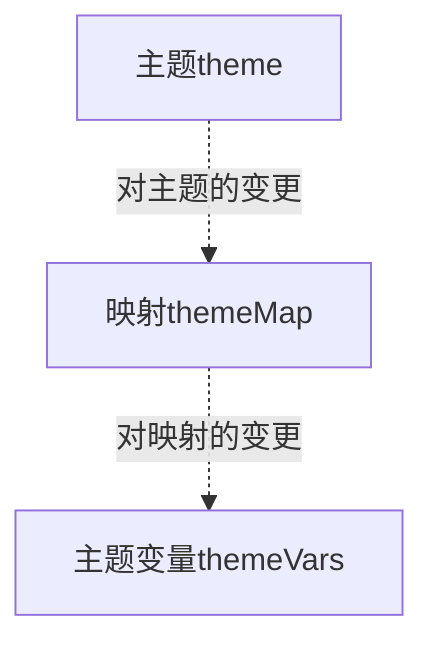

# 主题工具系统
## 主题生成

* 组件使用主题变量调整展示结果
* 主题与映射可以生成主题变量
* 主题和映射可以分别变更,并选择是否应用变更
* 变更包括主题和映射增、删、改
## 类型设计
### 主题元和主题 `@/utils/theme/Theme.ts`  
主题是名称与主题元的映射关系.主题元是对应名称所指示的描述和值.  
```ts
/** 主题元 */
type ThemeItem = {
  /** 主题元描述 */
  desc: string,
  /** 数字、字符串或颜色值 */
  value: number | string
}

/** 主题 */
type Theme = Map<string, ThemeItem>
```
#### 约定
* 主题元名称  
  合法名称必须经过正则表达式`/^@([a-z]+-)*[a-z]+$/`的校验.'@'开头,后续是'-'隔开的小写字母,例如`@primary-color`.导出函数`isLegalThemeItemName`用于判断名称是否合法.
* `ThemeItem['value']`的解释
  value为字符串时:如果value是合法rgba颜色,那么它将被识别为颜色;否则作为普通字符串处理.
#### 示例
```ts
Map
{
    '@version' => { desc:'版本号', value:'1' },
    '@theme-name' => { desc:'主题名', value:'example' },
    '@primary-color' => { desc:'主题主色', value:'rgba(64,150,255,1)' },
    '@title-font-size' => { desc:'文本主字号', value:24, unit:'px', type:'integer'}
}
```
#### 主题变更
主题变更是主题元名称与变更结果的映射
```ts
/** 变更类型 */
export type ThemeEdit = { type: 'add', value: ThemeItem } | { type: 'delete' } | { type: 'change', value: ThemeItem['value'] }

/** 主题变更 */
export type ThemeEditRecorder = Map<string, ThemeEdit>
```
##### 主题变更的约定
* 映射的key是合法主题元名称,但不必包含在主题中.
* 对变更的解释
  假设存在变更`key => { type, value }`
  - 若type为'delete',则主题中同名主题元被视为删除;
  - 若type为'change'且key在主题中,则value被视为该主题元的新值;
  - 若type为'add'且key在主题中,视为同名主题元被value完全替换;
  - 若type为'add'且key不在主题中,则视作主题中增加映射`key => value`.
##### 实用函数
* `addThemeItem`  
  `(themeEditRecorder: ThemeEditRecorder, name: string, value: ThemeItem)=>void`  
  创建或替换与`name`同名的主题元.这个函数会修改参数`themeEditRecorder`
* `deleteThemeItem`  
  `(theme: Theme, themeEditRecorder: ThemeEditRecorder, name: string)=>void`  
  删除与`name`同名的主题元.这个函数会修改参数`themeEditRecorder`.
* `changeThemeItem`  
  `(theme: Theme, themeEditRecorder: ThemeEditRecorder, name: string, value: ThemeItem['value'])=>void`  
  修改与`name`同名的主题元.这个函数会修改参数`themeEditRecorder`.
* `getEditedTheme`
  `(theme: Theme, themeEditRecorder: ThemeEditRecorder)=>Theme`
  取得应用变更后的主题
##### 主题变更示例
变更
```ts
Map
{
    '@version' => '1.0.1'
}
```
应用变更的主题
```ts
Map
{
    '@version' => { desc:'版本号', value:'1.0.1' },
    '@theme-name' => { desc:'主题名', value:'example' },
    '@primary-color' => { desc:'主题主色', value:'rgba(64,150,255,1)' },
    '@title-font-size' => { desc:'文本主字号', value:24, unit:'px', type:'integer'}
}
```
