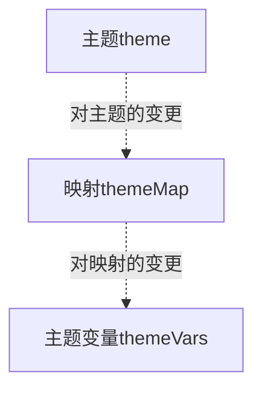

# 主题工具系统
## 主题生成

* 组件使用主题变量调整展示结果
* 主题与映射可以生成主题变量
* 主题和映射可以分别变更,并选择是否应用变更
* 变更包括主题和映射增、删、改
## 类型设计
### 主题元和主题 `@/utils/theme/Theme.ts`  
主题是名称与主题元的映射关系.主题元是对应名称所指示的描述和值.  
```ts
/** 主题元 */
type ThemeItem = {
  /** 主题元描述 */
  desc: string,
  /** 数字、字符串或颜色值 */
  value: number | string
}

/** 主题 */
type Theme = Map<string, ThemeItem>
```
#### 约定
* 主题元名称  
  合法名称必须经过正则表达式`/^@([a-z]+-)*[a-z]+$/`的校验.'@'开头,后续是'-'隔开的小写字母,例如`@primary-color`.导出函数`isLegalThemeItemName`用于判断名称是否合法.
* `ThemeItem['value']`的解释
  value为字符串时:如果value是合法rgba颜色,那么它将被识别为颜色;否则作为普通字符串处理.
#### 示例
```ts
Map
{
    '@version' => { desc:'版本号', value:'1' },
    '@theme-name' => { desc:'主题名', value:'example' },
    '@primary-color' => { desc:'主题主色', value:'rgba(64,150,255,1)' },
    '@title-font-size' => { desc:'文本主字号', value:24, unit:'px', type:'integer'}
}
```
#### 主题变更
主题变更是主题元名称与变更结果的映射
```ts
/** 变更类型 */
export type ThemeEdit = { type: 'add', value: ThemeItem } | { type: 'delete' } | { type: 'change', value: ThemeItem['value'] }

/** 主题变更 */
export type ThemeEditRecorder = Map<string, ThemeEdit>
```
##### 主题变更的约定
* 映射的key是合法主题元名称,但不必包含在主题中.
* 对变更的解释
  假设存在变更`key => { type, value }`
  - 若type为'delete',则主题中同名主题元被视为删除;
  - 若type为'change'且key在主题中,则value被视为该主题元的新值;
  - 若type为'add'且key在主题中,视为同名主题元被value完全替换;
  - 若type为'add'且key不在主题中,则视作主题中增加映射`key => value`.
##### 实用函数
* `addThemeItem`  
  `(themeEditRecorder: ThemeEditRecorder, name: string, value: ThemeItem)=>void`  
  创建或替换与`name`同名的主题元.这个函数会修改参数`themeEditRecorder`
* `deleteThemeItem`  
  `(theme: Theme, themeEditRecorder: ThemeEditRecorder, name: string)=>void`  
  删除与`name`同名的主题元.这个函数会修改参数`themeEditRecorder`.
* `changeThemeItem`  
  `(theme: Theme, themeEditRecorder: ThemeEditRecorder, name: string, value: ThemeItem['value'])=>void`  
  修改与`name`同名的主题元.这个函数会修改参数`themeEditRecorder`.
* `getEditedTheme`
  `(theme: Theme, themeEditRecorder: ThemeEditRecorder)=>Theme`
  取得应用变更后的主题
##### 主题变更示例
变更
```ts
Map
{
    '@version' => '1.0.1'
}
```
应用变更的主题
```ts
Map
{
    '@version' => { desc:'版本号', value:'1.0.1' },
    '@theme-name' => { desc:'主题名', value:'example' },
    '@primary-color' => { desc:'主题主色', value:'rgba(64,150,255,1)' },
    '@title-font-size' => { desc:'文本主字号', value:24, unit:'px', type:'integer'}
}
```
### 属性映射和主题映射 `@utils/theme/ThemeMap.ts`
主题映射是主题变量的属性与生成结果的映射.生成结果可以是属性映射,也可以是具有下级结果的子映射
```ts
/** 属性映射 */
type PropertyMap = {
  /** 对主题变量的描述 */
  desc: string,
  /** 对应主题变量的值 主题元名称、颜色、数字或者他们的数组 */
  value: string | number | (string | number)[]
}

/** 具有下级结构的子映射 */
type SubThemeMap = {
  /** 对当前层级主题变量的描述 */
  desc: string,
  /** 主题变量中的下级属性 */
  children: ThemeMap
}

/** 主题映射 */
type ThemeMap = Map<string, PropertyMap | SubThemeMap>
```
#### 约定  
* `PropertyMap['value']`的解释
  value描述了对应属性的值:
  - 若value是主题包含的合法主题元,则它被解释为对应主题元的值;
  - 若value是合法rgba颜色,则它被解释为颜色值;
  - 若value是普通字符串或数字,以value作为此属性的值;
  - value是数组时,它的每一项分别按照上述规则解释后重新组合为数组.
* 对主题元名称的拓展
  符合正则表达式`/^@([a-z]+-)*[a-z]+(-G\d+)?(-A\d+)?$/`被视为合法主题元的拓展.以`@primary-color-G3-A100`为例,它的含义是以`@primary-color`为主色生成的系列色的第3个颜色,且透明度为100.
#### 示例
```ts
Map
{
    'version' => { value:'@version', desc:'当前主题版本号' },
    'themeName' => { value:'@theme-name', desc:'当前主题名称' },
    'example' => {
        desc:'示例',
        children:
        Map{
            'Title' => {
            desc:'标题',
            children:
                Map{
                    'size' => { value:'@title-font-size', desc:'标题字号' }
                }
            },
            'Panel' => {
                desc:'面板',
                children:
                Map{
                    'gradient' => { 
                        value:['@primary-color-G3-A100','@primary-color-G3-A0'],
                        desc:'渐变背景'
                    }
                }
            }
        }
    }
}
```
#### 映射变更
定义映射索引为`映射中各级属性名用'.'连接形成的字符串`.`'version'`,`'example'`,`'example.Title.size'`都是示例映射的映射索引.映射索引可以指向映射中不存在的对象或属性.  
映射变更是映射索引与变更结果的映射.
```ts
/** 变更类型 */
type ThemeMapEdit = { type: 'add', value: SubThemeMap | PropertyMap } | { type: 'delete' } | { type: 'change', value: SubThemeMap['children'] | PropertyMap['value'] }

/** 映射变更 */
type ThemeMapEditRecorder = Map<string, ThemeMapEdit>
```
##### 映射变更的约定
* 变更总是按照顺序同步地应用于映射.因此可以先添加一个映射再对齐进行修改.
* 对变更的解释
  假设存在变更`key => { type, value }`
  - 若type为'delete',key的目标被视作删除
  - 若type为'change'且key的目标在映射中,这个属性映射的的值(children或value)被value替换
  - 若type为'add'且key的目标在映射中,视为key的目标被value完全替换
  - 若type为'add'且key的目标仅最后一部分索引不在映射中,视为以value创建新映射.(例如'example.Title1'会创建新映射,而'example1.Title1'则不会)
##### 实用函数
* `isPropertyMap`
  `(value: PropertyMap | SubThemeMap)=> value is PropertyMap`
  `判断是否是属性映射`
* `isPropertyMapEdit`
  `(value: SubThemeMap['children'] | PropertyMap['value'])=> value is PropertyMap['value']`
  判断一个变更是否是属性映射变更
* `themeMapHas`  
  `(themeMap: ThemeMap, themeMapEditRecorderKey: string)=> Boolean`  
  判断`key`所指示的子映射是否被映射包含
* `addThemeMap`  
  `(themeMapEditRecorder: ThemeMapEditRecorder, themeMapEditRecorderKey: string, value: Property | ThemeMap)=>void `  
  创建或替换key指示的子映射.这个函数会修改参数`themeMapEditRecorder`.
* `deleteThemeMap`  
  `(themeMap: ThemeMap, themeMapEditRecorder: ThemeMapEditRecorder, themeMapEditRecorderKey: string)=>void `  
  删除key指示的子映射.这个函数会修改参数`themeMapEditRecorder`.
* `changeThemeMap`  
  `(themeMap: ThemeMap, themeMapEditRecorder: ThemeMapEditRecorder, themeMapEditRecorderKey: string, value: Property['value'])=>void `  
  修改key指示的属性映射.这个函数会修改参数`themeMapEditRecorder`.
* `getEditedThemeMap`  
  `(themeMap: ThemeMap, themeMapEditRecorder: ThemeMapEditRecorder): ThemeMap`  
  取得应用变更后的映射
##### 映射变更示例
变更
```ts
Map
{
    'example.Title.size'=>'30px'
}
```
应用变更的映射
```ts
Map
{
    'version' => { value:'@version', desc:'当前主题版本号' },
    'themeName' => { value:'@theme-name', desc:'当前主题名称' },
    'example' => {
        desc:'示例',
        children:
        Map{
            'Title' => {
            desc:'标题',
            properties:
                Map{
                    'size' => { value:'30px', desc:'标题字号' }
                }
            },
            'Panel' => {
                desc:'面板',
                properties:
                Map{
                    'gradient' => { 
                        value:['@primary-color-G3-A100','@primary-color-G3-A0'],
                        desc:'渐变背景'
                    }
                }
            }
        }
    }
}
```